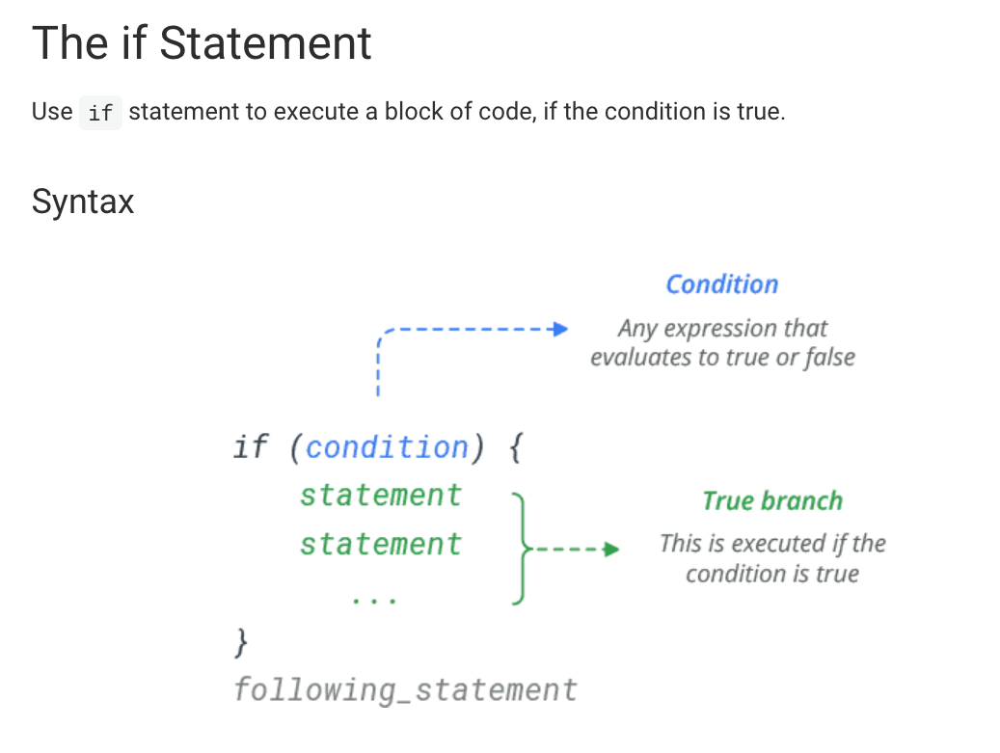
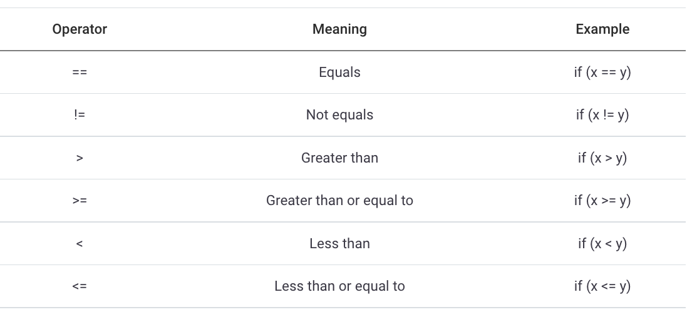
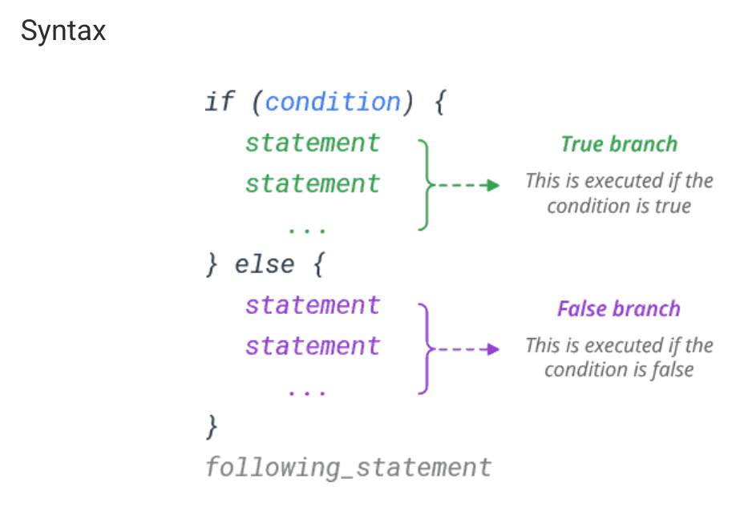
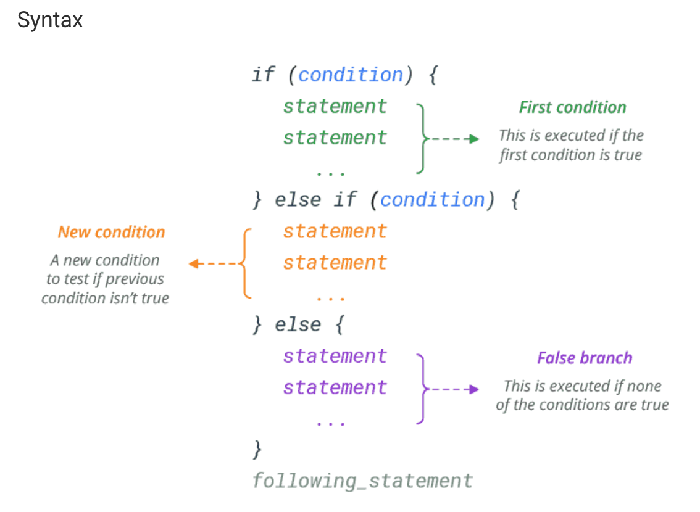
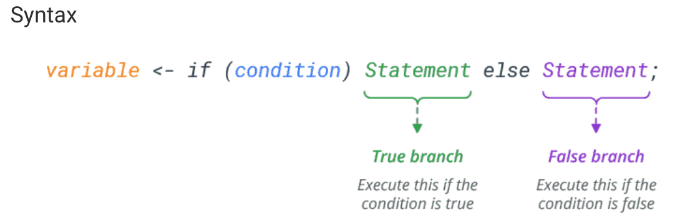
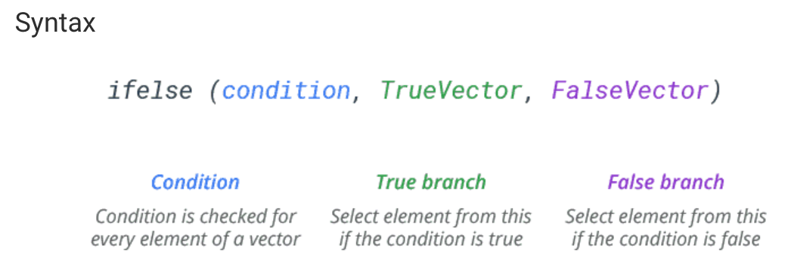
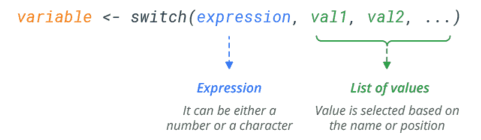
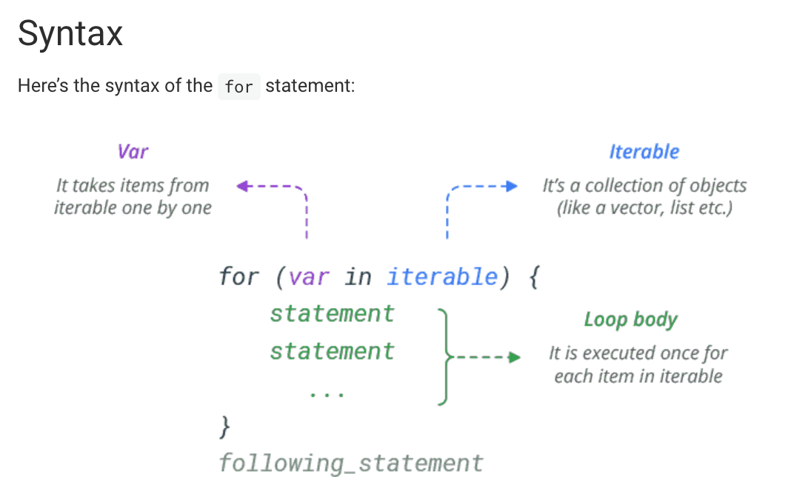
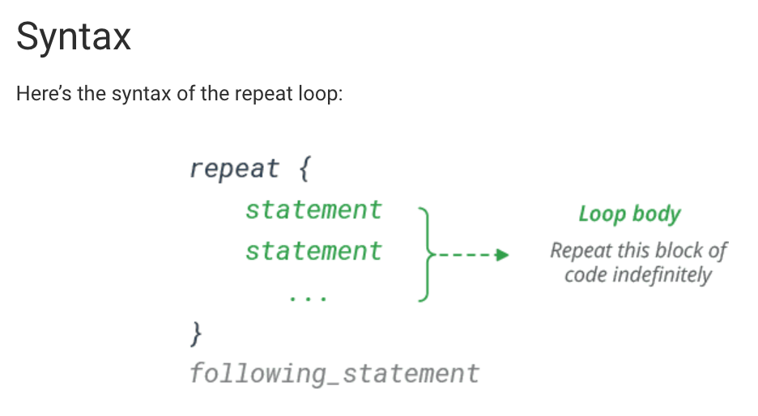
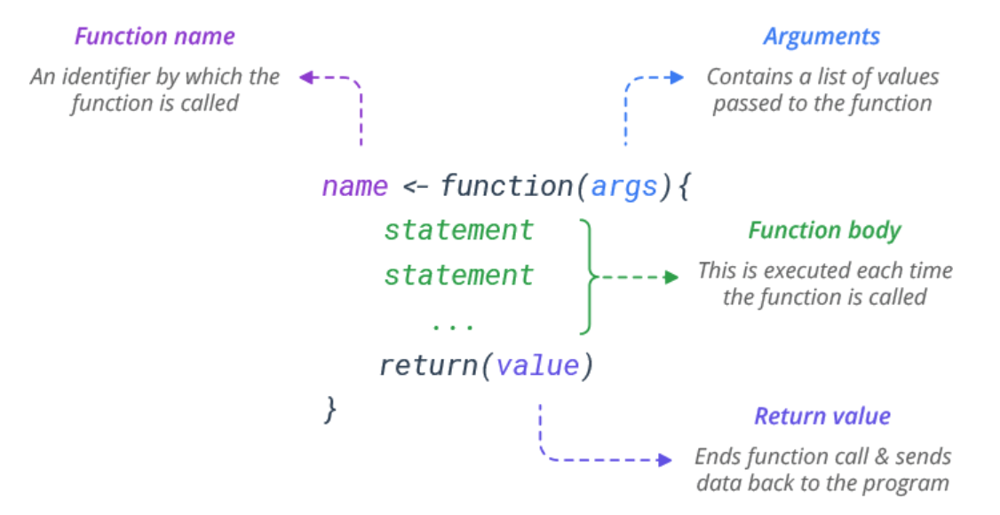

# Introduction to R {#intro}

## Part 1: Vector

Define variable / vector

### Numbers

```{r}
# Type in a numerical data, assign them to the variable: weight
weight = c(60,72,57,90,95,72)
# Print out the variable
weight
# You can also type in decimals
height = c(1.75,1.80,1.65,1.90,1.74,1.91)
# Or even formulas, assign to the variable.
bmi = weight/(height)^2
bmi
```

### Strings (nominal)

```{r}
# Characters between the quotation marks are consider strings
A = c("NewYork","London","San Francisco")
A
```

### Logical

```{r}
# A logical vector is a vector that only contains TRUE and FALSE values. In R, true values are designated with TRUE, and false values with FALSE.
B=c(T,T,F,F)
B
bmi > 25  # relational expressions
```

### Generate a sequence of numbers 

```{r}
seq(4,9) #sequence from 4 to 9, increment defaults to 1, alternatively, 4:9
seq(4,10,2) #sequence from 4 to 10, increment is 2
seq(1,10,.1) #sequence from 1 to 10, increment is .1
seq(-8,9,.5) #sequence from -8 to 9, increment is .5
```

### Replicate values

```{r}
exp1 <- c(1,2,3,4,5) #create a vector named as exp1
rep(exp1,3) #repeat 3 times 

ha=c(1,2,3,"sun")
rep(ha,4) #repeat "ha" four times
rep(ha,1:4) #each element is repeated different times, according to the second argument
rep(3:4,c(100,200)) #the first element repeat 100 time, the second 200 times
```

### Practice Questions

#### Question 1

Create a sequence (name it with your first name) ranging from 1 to 100, increment is 1

#### Question 2

Repeat the sequence just created 3 times

#### Question 3

Calculate the ratios between the two variables as last/first, and multiply by 2.

## Part 2: Basic Statistical Analysis

### Buiding a simulated data set

```{r}
# We use the following functions to build a simulated data set.
ACT_score <- round(runif(n=100,min=18,max=25),0)
```

### Basic Statistical function

```{r}
# calculate summation
sum(ACT_score) 
# calculate average score
mean(ACT_score)
# calculate median score
median(ACT_score) 
# calculate variance
var(ACT_score) 
# calculate standard deviation
sd(ACT_score) 
# print vector length (sample size)
length(ACT_score) 
# calculate square root of each number
sqrt(ACT_score) 
#--with NA, print order of each number in the vector
order(ACT_score)    
# calculate range of the vector
range(ACT_score) 
#--omit NA, sort date from low to hight
sort(ACT_score)  
#--make a table of counts
table(ACT_score)  

#-- Using the function "describe" from the "psych" package. Please attach the psych package
library(psych)
describe(ACT_score)
```

### Practice Questions

Use the Data set bellow:

```{r}
GRE_score <- round(runif(250,130,170),0)
?runif
```

#### Question 1

Report summation of all reported scores.

#### Question 2

Report average score based on all reported scores

#### Question 3

Report median score based on all reported scores

#### Question 4

Report variance of all reported scores

#### Question 5

Reorder all scores

#### Question 6

Build a table of counts of each score

## Part 3: Matrix Computation

### Build a matrix

```{r}
x=1:12 
#set the dimension of the matrix
dim(x)=c(3,4) #three rows and four cols 
x
```

### Define a matrix

```{r}
# Different from the above matrix, we define a matrix use matrix function
matrix(1:12,nrow=3,byrow=T) 
```

### Name the rows/columns

rownames(); colnames()----can be used to a data matrix

```{r}
x=matrix(1:12, nrow=3,byrow=T)
x
rownames(x)=LETTERS[1:3]
colnames(x)=LETTERS[4:7]
x
colnames(x) <- c("gpa","quiz1","quiz2","final")
x
```

### Operation on matrix

```{r}
# The transpose of a matrix is simply a flipped version of the original matrix. We can transpose a matrix by switching its rows with its columns.  
t(x)
#multiply two matrix, if they are conformable
x%*%t(x) #check the dimensions  

t(x)%*%x
```

### Glue vectors together

```{r}
# Using cbind() function to combine columns
cbind(A=1:4,B=5:8,C=9:12)
# Using rbind() function to combine rows
rbind(A=1:4,B=5:8,C=9:12)
```

### Inverse the matrix

The inverse of a square matrix A, sometimes called a reciprocal matrix, is a matrix $A^{-1}$ such that $AA^{-1}=I$ , where $I$ is the identity matrix.

[C] The fractions() need load "MASS" Package.

```{r}
# Load the package "MASS" to use the fractions function
library(MASS)
# Build a square matrix A. 
A <- matrix(c(2,3,2,2), nrow=2,byrow=T)
# Print out
A 
#inverse the matrix       
inv_A <- solve(A,tol=1e-19)

#round              
round(solve(A,tol=1e-19),3) #to the third digits
#show as rationals  
fractions(solve(A,tol=1e-19))

# Ax=b: solve(A,b)
# create an Identity matrix
ident_matrix <- diag(2)
solve(A,diag(2))

```


### Practice Questions

#### Question 1
Create a 2 by 2 matrix named "MM" with c(1,5,9,10) arranged by row

#### Question 2
Please inverse the matrix "MM", name it as MM-T

#### Question 3
Multiply the two matrices "MM" %*% "MM-T", and show the result


## Part 4: Data Manipulation

### Load the Data

```{r}
# Load the package for illustrations
library(car)
# Load the data set
data(Prestige)
# Check the dimension of the data
dim(Prestige) # 102 observations, each observation has 6 variables.
# Checking the variable names
names(Prestige)
# subset the data
Prestige[1:10,1:3] #selecting the first 10 subjects with first three variables 
Prestige[,1:3] #selecting all subjects with first three variables 
Prestige$education #selecting the variable "education"
Prestige[1:10,c("education","income")] #selecting the first 10 subjects with the variables "education" and "income"
```

### Select Specific Data

```{r}
# put 1's in the first col., others in 2-4th
X=cbind(1,as.matrix(Prestige[,1:3])) 
X
# adding ID
X1=cbind(seq(1:102),as.matrix(Prestige[,1:3])) 
colnames(X1)= c("ID","education", "income", "women")
X1
# select only the 4th column of the dataset: Prestige
y=Prestige[,4] 
y
# select the first five subjects with all columns
X[1:5,] 
#select variables ("education" ,"prestige") and the first five subjects
Prestige[1:5,c("prestige","education")] 
```

### Correlation and Covariate Matrix

```{r}
# Calculate the correlations among three variables
R=cor(cbind(Prestige$education,Prestige$income,Prestige$women))
R # Correlation matrix
plot(Prestige$education,Prestige$income)
# Calculate the covariance among three variables
S =cov(cbind(Prestige$education,Prestige$income,Prestige$women))
S # Covariance matrix
```

### Matrix Diagonals

```{r}
# extract diagonal of R (correlation matrix)
diag(R)    
# set diagonal of R
diag(R)=NA 
# make diagonal matrix
diag(1:3)  
# order-3 identity matrix
diag(3)
```

### Practice Questions
please upload the Grit study.csv

#### Question 1
check the dimentions and names of the dataset 

#### Question 2

Using the "describe" function from "psych" package to summarize the dataset

#### Question 3
creat a new variable called "ID" for the given dataset

#### Question 4
rename the last three columns as "internal", "external", and "support"

#### Question 5
Subsetting: select the 10 subjects with IDs from 11 to 20, under two variables: internal and grit 

#### Question 6
Calculate the correlation and covariance between the two variables:internal and grit 

#### Question 7

Extract the diagonal elements of the covariance matrix

#### Question 8
Calculate the inverse matrix of the covariance matrix


## Part 5: Factor, List, and Dataframe

### Factors

Categorical variables whose input are numeric: "factors" Terminology: a factor has a set of "levels"

```{r}
## build a continuous variable
pain=c(0,3,2,2,1) 
## set the level of pain as a factor
fpain=factor(pain,levels=0:3) ## categorical has a order: ordinal scale
## rename the factors of our "fpain" variable
levels(fpain)=c("none","mild","medium","sever") 
# Print pain (show as only numbers)
pain
# Print fpain (show as categorical names)
fpain
# Turn the categorizes into numbers 
as.numeric(fpain)-1
# Check the levels of a variable
levels(fpain)
# Internally, the 4-level factor above consists of 2 items 
# (a)a vector of integers between 1 and 4
# (b)a character vector of length 4 containing strings describing what the 4 levels are
```

### Building a list

Lists are the R objects which contain elements of different types like − numbers, strings, vectors and another list inside it. A list can also contain a matrix or a function as its elements. List is created using list() function.

```{r}
# Combine a collection of objects into a larger composite object. 
# Generate two vectors with Exam scores
exam1=c(50,60,72,92,83,89,58,81)             
exam2=c(60,71,84,94,95,90,77,87)
# Give names to the objects
# Build a list containing both exams
scores=list(midterm=exam1,final=exam2) 
# print the composite object
scores
# You can use "$" sign to extract the specific object in a list
# extract named components 
scores$final
```

### Building a Dataframe

```{r}
# Building a data frame using exam data we previously created
d=data.frame(exam1,exam2)
#the data are paired, the same student has a midterm and a final score
d     
# Use the "$" sign extract columns from a data frame 
d$exam1    
```

### Indexing (subsetting) Dataset

```{r}
# Select the 4th element in vector exam1
exam1[4] 
# The 1st,3rd,6th,7th element of "exam1"; alternatively
exam2[c(1,3,6,7)] 
# Build an indexing vector "v"
v=c(1,3,6,7)
# Select the indexing elements of "v" from data exam2
exam2[v]
# Select the first 6 elements
exam2[1:6]
# Select all the elements except the positions specified in v
exam2[-v]
# Conditional selection
exam2[exam1>=60]
# Select all the exam2 scores where exam 1's scores either less than 70, or larger than 90. 
exam2[exam1<70 |exam1>90] # "|"means "or"
# Select all the exam2 scores where exam 1's scores between 70 to 79.
exam2[exam1>=70 & exam1<80] # & means "and"
```

### More examples on indexing dataset

```{r}
# We will use the same data frame d.
d=data.frame(exam1,exam2)
# The element in the 5th row, 1st column
d[5,1]
# The vector in the 5th row
d[5,]        
d[d$exam1>90,]
# Conditional selection with logical outcome
lo=d$exam1>60 
lo
# Use a logical vector as the indexing vector
d[lo,]    
```

### Subset and transform data

```{r}
# Use the previous exam data set we created.
d
# Subset the dataset where the exam1 scores are larger than 60
d2=subset(d,exam1>60)
d2
# Adding a new column "exam1bonus" using transform function
d3=transform(d,exam1bonus=exam1+5)
d3
```

### Practice Questions

#### Question 1

subset Prestige dataset for subjects whose income is higher than 10,000 without using the "subset" function

#### Question 2

subset Prestige dataset for subjects whose income is higher than 10,000 with using the "subset" function

#### Question 3

subset Prestige dataset for subjects whose income is higher than 10,000 and who are professors without using the "subset" function


## Part 6: conditional statement

### if statement

`if` statements tell R to run a line of code if a condition returns `TRUE`. An `if` statement is a good choice here because it allows us to control which statement is printed depending on which outcome occurs.

`if` Statement: use it to execute a block of code, if a specified condition is true



```{r}
time=c(9.2,7,7.1,8.2,10.1,11,9.3,4.5,6.6,7.9,10.8,7.8,8.3)
status=c("pass","fail","fail","fail","fail","pass","fail","fail","pass","pass","fail","pass","fail")
# Combine two variables into data frame "rate"
rate=data.frame(time,status)
rate
# use the if function to check the first participant's pass/fail condition
if (rate[1,2]=="pass"){
  print("You are awesome!")
}
```

Another simple example:

```{r}
# Making a simple comparison
x <- 7
y <- 5
if(x > y) {
  print("x is greater")
}

```

Likewise, you can use following comparison operators to compare two values:



### More Example

In R, any non-zero value is considered `TRUE`, whereas a zero is considered `FALSE.` That’s why all the below if statements are valid.

```{r}
# mathematical expression
x <- 7
y <- 5
if(x + y) {
  print("True")
}

# any non-zero value
if(-3) {
  print("True")
}
```

`if` Statement Without Curly Braces: If you have only one statement to execute, you can skip curly braces.

```{r}
x <- 7
y <- 5
if(x > y) print("x is greater")
```

Nested if Statement: You can write one `if` statement inside another `if` statement to test more than one condition and return different results.

```{r}
x <- 7
y <- 5
z <- 2
if(x > y) {
  print("x is greater than y")
  if(x > z) print("x is greater than y and z")
}
```


### The `else` statement

Use `else` statement to execute a block of code, if the condition is false.



A Simple if-else comparison:

```{r}
x <- 7
y <- 5
if(x > y) {
  print("x is greater")
} else {
  print("y is greater")
}
```

```{r}
# use the if function to check the second participant's pass/fail condition
if (rate[2,2]=="pass"){
  print("You are awesome!")
  } else {
    print("Working harder")
          } 
```

### The `else if` statement

Use `else if` statement to specify a new condition to test, if the first condition is false.

The `else if` statement allows you to further customize your control structure. You can add as many `else` if statements as you like.



Using `else-if` statement

```{r}
x <- 5
y <- 5
if(x > y) {
  print("x is greater")
} else if(x < y) {
  print("y is greater")
} else {
  print("x and y are equal")
}
```

In R, you can use as many `else if` statements as you want in your program. There’s no limit. However, it’s not a best practice when you want to make series of decisions. You can use switch() function as an efficient way.

```{r}
# This time we check the participant's studying time from "rate" data.
# Check the first participant's studying time 
if(rate[1,1]<=7){
  print("Study More")
  } else if (rate[1,1]>7 & rate[1,1]<11){
    print("No pain No gain!")
  } else if (rate[1,1]>=11) {
      print("You are on fire！")
    }
```

Multiple Conditions:

To join two or more conditions into a single `if` statement, use logical operators viz. `&&` (and), `||` (or) and `!` (not). `&&` (and) expression is True, if all the conditions are true.

```{r}
x <- 7
y <- 5
z <- 2
if(x > y && x > z) {
  print("x is greater")
}
```

`||` (or) expression is True, if at least one of the conditions is True.

```{r}
x <- 7
y <- 5
z <- 9
if(x > y || x > z) {
  print("x is greater than y or z")
}
```

`!` (not) expression is True, if the condition is false.

```{r}
x <- 7
y <- 5
if(!(x < y)) {
  print("x is greater")
}
```

### One Line If…Else

If you have only one statement to execute, one for if , and one for else , you can put it all on the same line:


Examples

```{r}
x <- 7
y <- 5
if (x > y) print("x is greater") else print("y is greater")
```

You can also use it to select variable assignment.

```{r}
x <- 7
y <- 5
max <- if (x > y) x else y
max
```

### The ifelse() Function

In R, conditional statements are not vector operations. They deal only with a single value.

If you pass in, for example, a vector, the `if` statement will only check the very first element and issue a warning.

```{r}
v <- 1:6
if(v %% 2) {
  print("odd")
} else {
  print("even")
}
```

The solution to this is the `ifelse()` function. The `ifelse()` function checks the condition for every element of a vector and selects elements from the specified vector depending upon the result.

Here’s the syntax for the `ifelse()` function.



Example:

```{r}
v <- c(1,2,3,4,5,6)
ifelse(v %% 2 == 0, "even", "odd")
```

You can even use this function to choose values from two vectors.

```{r}
v1 <- c(1,2,3,4,5,6)
v2 <- c("a","b","c","d","e","f")
ifelse(c(TRUE,FALSE,TRUE,FALSE,TRUE,FALSE), v1, v2)
```

### R switch() function

The nested if…else statement is especially useful when you want to execute a certain block of code when a condition is met.

However, if you want to select values based only on a condition, you have a better option: Use the `switch()` function.

Here’s the syntax of the `switch()` function:



`switch()` with String Expression

If the expression is a character string, `switch()` will return the value based on the name of the element.

```{r}
# Select element by name and return its value
x <- "a"
v <- switch(x, "a"="apple", "b"="banana", "c"="cherry")
v

x <- "c"
v <- switch(x, "a"="apple", "b"="banana", "c"="cherry")
v
```

In case of multiple matches, the value of first matching element is returned.

```{r}
# Select first match and return its value
x <- "a"
v <- switch(x, "a"="apple", "a"="apricot", "a"="avocado")
v
```

Default case

In the case of no match, the unnamed element (if any) is returned. If there are more than one unnamed elements present, an error is raised.

```{r}
# Select unnamed element in the case of no match
x <- "z"
v <- switch(x, "a"="apple", "b"="banana", "c"="cherry", "grapes")
v
```

`switch()` with Numeric Expression

The numeric version of `switch()` works in a slightly different way. Instead of using names, the return value is determined purely with positional matching (Index).

```{r}
# Select element by position and return its value
x <- 1
v <- switch(x, "apple", "banana", "cherry")
v

x <- 3
v <- switch(x, "apple", "banana", "cherry")
v
```

If the numeric value is out of range (greater than the number of choices), `NULL` is returned.

```{r}
x <- 5
v <- switch(x, "apple", "banana", "cherry")
v
```

### Use "for" loop

The `for` statement in R is a bit different from what you usually use in other programming languages.

Rather than iterating over a numeric progression, R’s `for` statement iterates over the items of a vector or a list. The items are iterated in the order that they appear in the vector.



Basic Examples

```{r}
# Iterate through a vector
colors <- c("red","green","blue","yellow")
for (x in colors) {
  print(x)
}
```

```{r}
# Iterate through a list
l <- list(3.14, "Hi", c(1,2,3))
for (x in l) {
  print(x)
}
```

If you need to execute a group of statements for a specified number of times, use sequence operator : or built-in function `seq()`

```{r}
# Print 'Hello!' 3 times
for (x in 1:3) {
  print("Hello!")
}
# Iterate a sequence and square each element
for (x in seq(from=2,to=8,by=2)) {
  print(x^2)
}
```

`for` Loop Without Curly Braces: If you have only one statement to execute, you can skip curly braces.

```{r}
# Print the numbers 0 to 4
for (x in 0:4) print(x)
```

Nested for loop:

A nested for loop is a loop within a loop. They are useful for when you want to repeat something several times for several things.

```{r}
for(x in 1:3) {
  for(y in 1:2) {
    print(paste(x, y))
  }
}
```

`Break` in for Loop: In R, `break` statement is used to exit the loop immediately. It simply jumps out of the loop altogether, and the program continues after the loop.

```{r}
# Break the loop at 'blue'
colors <- c("red","green","blue","yellow")
for (x in colors) {
  if (x == "blue")
    break
  print(x)
}
```

Next (continue) in for Loop: The next statement skips the current iteration of a loop and continues with the next iteration.

```{r}
# Skip 'blue' using continue statement
colors <- c("red","green","blue","yellow")
for (x in colors) {
  if (x == "blue")
    next
  print(x)
}
```

```{r}
# Use the for loop to check whether they pass the exam
for (i in 1:nrow(rate)) {
  if (rate[i,2]=="pass"){
  print("You are awesome!")
  } else {
    print("Working harder")
          } 
}
# Use the for loop to check how much time they spent on studying
for (i in 1:nrow(rate)){
  if(rate[i,1]<=7){
  print("Study More")
  } else if (rate[i,1]>7 & rate[i,1]<11){
    print("No pain No gain!")
  } else if (rate[i,1]>=11) {
      print("You are on fire！")
    }
}
```

### R Repeat Loop

A `repeat` loop just repeats a block of code indefinitely. In this loop, no condition checking is performed in order to end the loop.

To stop repeating the loop, you must put a condition explicitly inside it with break statement. Failing to do so will create an infinite/endless loop.



Examples:

A repeat loop without a break statement results into an *infinite/endless* loop.

```{r}
# infinite loop
# repeat {
#  print("Press Esc to stop me!")
# }
```

However, you can put a condition explicitly inside the body of the loop and use the break statement to exit the loop.

```{r}
# Iterate until x becomes 5
x <- 1
repeat {
  print(x)
  if (x > 4)
    break
  x <- x + 1
}
```

## Part 7: R functions

### Make a function in R

In simple terms, a function is a block of statements that can be used repeatedly in a program. R provides many built-in functions and allows programmers to define their own functions.

Here’s the syntax of a function in R:



Create a Function: To define a function in R, use the `function` command and assign the results to a function name.

```{r}
# Create a function 'myfunc'
myfunc <- function() {
  print('Hello, World!')
}
```

If you have only one statement to execute, you can skip curly braces.

```{r}
# Write a function in one line
myfunc <- function() print('Hello, World!')
```

Call a Function: You can call (run) the function by adding parentheses after the function’s name.

```{r}
myfunc <- function() {
  print('Hello, World!')
}
myfunc()
```

Pass Arguments: You can send information to a function through arguments. Arguments are declared after the function keyword in parentheses.

You can send as many arguments as you like, just separate them by a comma`,`.

```{r}
sum <- function(x, y) {
  x + y
}
sum(2, 3)
```

Named Arguments: If you pass arguments to a function by name, you can put those arguments in any order.

```{r}
pow <- function(x, y) {
  x ^ y
}

# using argument names
pow(x=2, y=3)

# changing the order
pow(y=3, x=2)
```

Default Argument Value: You can assign a default value to an argument. So, when you call the function without argument, it uses the default value.

```{r}
# Set default value ‘3’ to second argument
pow <- function(x, y=3) {
  x ^ y
}

# function will use default y value
pow(2)

# specifying a different y value
pow(2, 4)
```

Return a Value: To return a value from a function, simply use a `return()` function.

```{r}
sum <- function(x, y) {
  return(x + y)
}

sum(2, 3)
```

If you do not include any `return()` function, it automatically returns the last expression.

```{r}
sum <- function(x, y) {
  x + y
}

sum(2, 3)
```

Return Multiple Values: You can return multiple values by saving the results in a vector (or a list) and returning it.

```{r}
math <- function(x, y) {
  add <- x + y
  sub <- x - y
  mul <- x * y
  div <- x / y
  c(addition = add, subtraction = sub,
    multiplication = mul, division = div)
}

math(6, 3)
```

Lazy Evaluation: R functions perform lazy evaluation that dramatically extends the expressive power of functions. It is the technique of not evaluating arguments unless and until they are needed in the function.

```{r}
myfunc <- function(x, y) {
  if(!x){
    return(y)
  }
  else{
    return(x)
  }
}

# y is not evaluated so not including it causes no harm
myfunc(6)

# y is evaluated so not including it raises error
# myfunc(0)
```

Variable Length Argument

In R, it is often convenient to accept a variable number of arguments passed to the function. To do this, you specify an ellipsis `(...)` in the arguments when defining a function.

For example, below function prints the first argument and then passes all the other arguments to the `summary()` function.

```{r}
myfunc <- function(x,...) {print(x); summary(...)}
v <- 1:10

myfunc("Summary of v:", v)
```

You can also directly refer to the arguments within the argument list (...) through the variables ..1, ..2, to ..9.

For example, ..1 refers to the first argument, ..2 refers to the second, and so on.

```{r}
myfunc <- function(...) {cat(..1, ..2)}

myfunc("Hello", "World!")
```

It is also possible to read the arguments from the argument list by converting the object (...) to a list within the function body.

For example, below function simply sums all its arguments:

```{r}
addAll <- function(x,...) {
  args <- list(...)
  for (a in args) x <- x + a
  x
}

addAll(1,2)
addAll(1,2,3,4,5)
```

## Part 8: Splitting data & implicit loops

### Splitting the data

```{r}
# Type in the data set with two variables "time" and "status"
# Time means study hours that students spent on studying
# Status is an indicator showing whether a candidate pass or fail the exam
time=c(9.2,7,7.1,8.2,10.1,11,9.3,4.5,6.6,7.9,10.8,7.8,8.3)
status=c("pass","fail","fail","fail","fail","pass","fail","fail","pass","pass","fail","pass","fail")
# Combine two variables into data frame "rate"
rate=data.frame(time,status)
# filter out how much time do participants spent when they passed the exams. 
sta.pass=rate$time[rate$status=="pass"] 
sta.pass
### ? what is the meaning of this line 
sta.fail=rate$time[rate$status=="fail"]
sta.fail
```

### Function "apply"

```{r}
# Use ?+function name to check the help document of certain function
?matrix
# Use function "matrix" and "rnorm" to build a random function
m=matrix(rnorm(12),nrow =4)
m
# Select the minimum value column wise 
apply(m,2,min) 
# the second argument: 1 is set to "row", 2 is set to "column"
# the function min() is applied to each column 
# Select the minimum value row wise 
apply(m,1,min) 
```

### Another example

```{r}
# Generate a matrix x
x <- cbind(x1 = rep(3,8), x2 = c(4:1, 2:5)) 
# Give rownames:a to h
dimnames(x)[[1]] <- letters[1:8]
# Use function sum() apply to each column
# Clean the environment, then run the following function
# col.sums <- apply(x, 2, sum) 
# Use function sum() apply to each row
# row.sums <- apply(x, 1, sum)
# Generate a table for the row sums, column sums and grand total
# rbind(cbind(x, Rtot = row.sums), Ctot = c(col.sums, sum(col.sums)))
```

### Use function "lapply"

The function lapply() applies over a list or a vector

```{r}
# Build a list
x <- list(a = 1:10, beta = exp(-3:3), logic = c(TRUE,FALSE,FALSE,TRUE))
# Compute the list mean for each list element
lapply(x,mean)
# Quantiles for each list element 0.25 0.50 0.75
lapply(x, quantile, probs = 1:3/4) 
```
