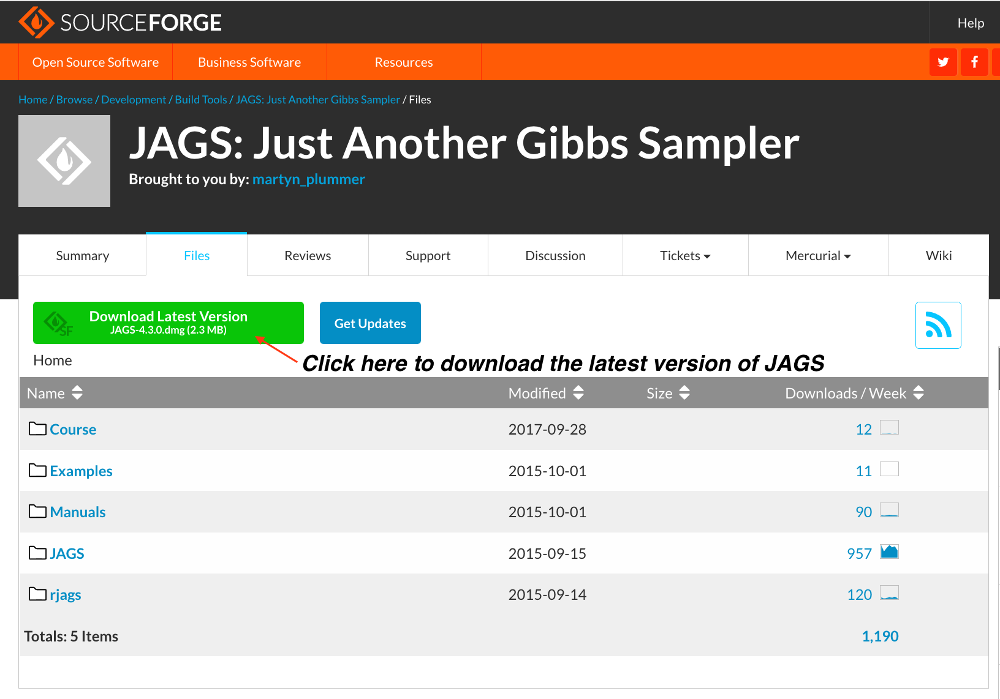
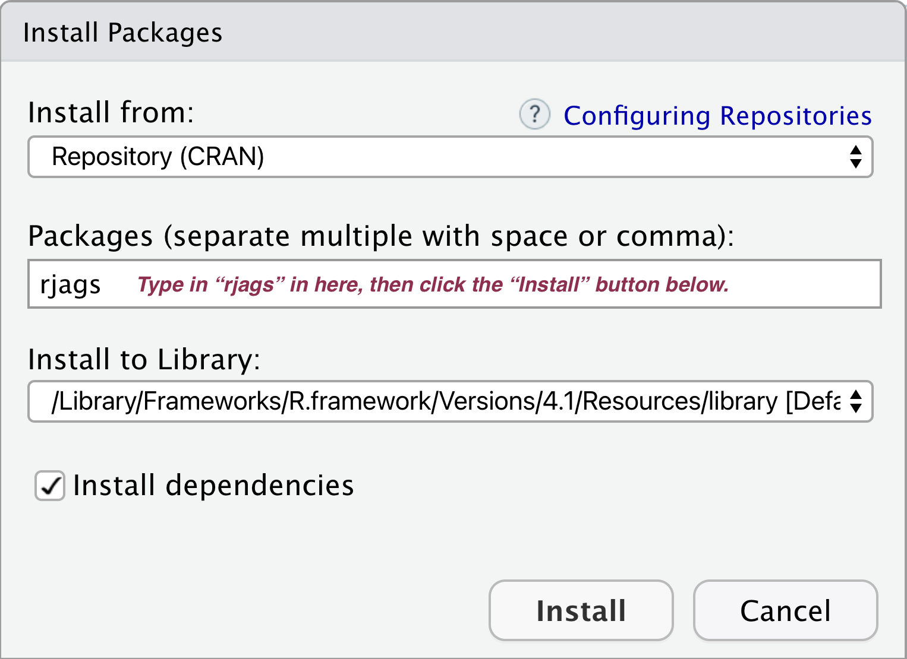

# Introduction to Bayesian Inference {#Bayes_Inf}

## Install the JAGS for R

### Install JAGS

The following are the steps to install the Bayesian sampling program JAGS.

- Go to website http://mcmc-jags.sourceforge.net for instructions. To download the JAGS installation program (JAGS –x.x.x.exe), visit the webpage https://sourceforge.net/projects/mcmc-jags/files.

- Run the JAGS installation program to install JAGS. When asked to Choose Install
Location, select the folder created earlier, e.g. C:\\Bayesian\\JAGS-4.2.0, and follow the installation instructions. If you are a mac user, then don't worry about the file location.

### Install Package rjags

The following are the steps to install R package rjags (to let R talk to JAGS). There are two ways to do this:

In the RStudio menu bar at the top of the screen, select Tools→Install Packages, then type rjags under Packages.

- Or you can in the R Studio console window, type `install.packages("rjags")`

